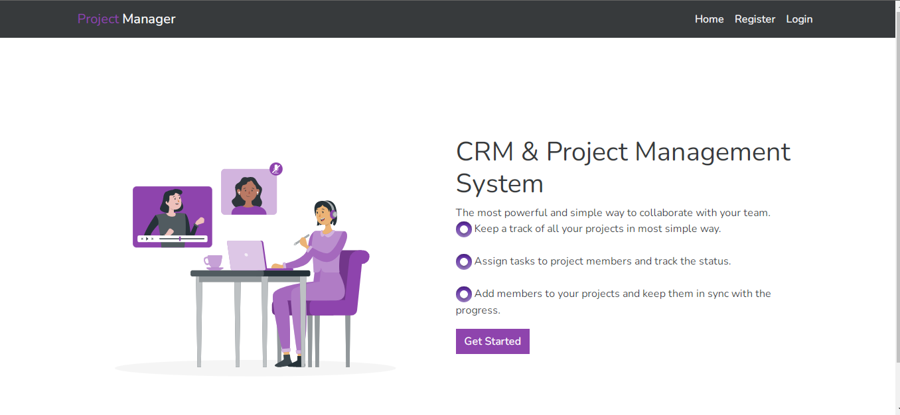

# Project Manager Website With  React
### promanager is simple way to collaborate with your team, Keep a track of all your projects in most simple way.

Live Demo can be viewed at https://promanager.netlify.app/


<div align="center">

<br/>


</div>


# Features
* Full Crud fuctionality
* User Authentication with react-redux
* Restapi with djangorestframework


## Clone the repository using the command below :

```bash
git clone https://github.com/patoski716/promanager-react.git

```

## Move into the directory where we have the project files : 

```bash
cd promanager-react

```

## Project setup
```
npm install
```

### Compiles and hot-reloads for development
```
npm start
```

### Compiles and minifies for production
```
npm run build
```
